> 作者：最后一个农民工@掘金，转载需注明出处。

文章中示例的源码地址：https://github.com/fffmoon/doubao-template-input

# vue3实现仿豆包模版式智能输入框

## 前言

> 目前ai浪潮如火如荼，相信各位同行都接过不少 AI 项目。今天和大家分享一个实用场景：**如何用 Vue3 实现类似豆包的模板式智能输入框**。

## 需求分析

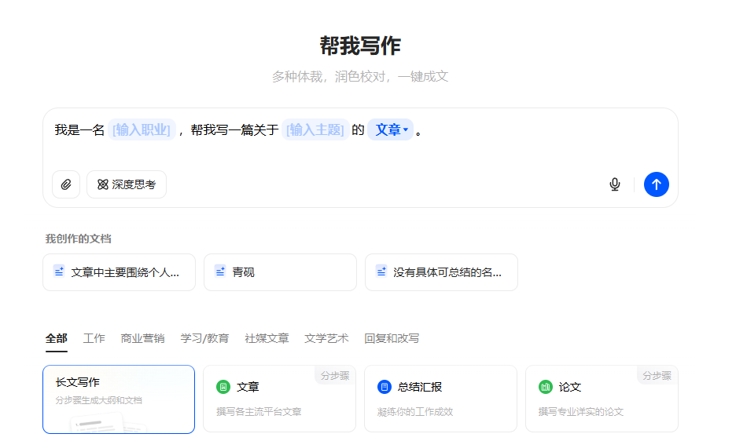

> **踩坑经验**：第一眼以为是富文本，细看才发现不简单。传统富文本编辑器（如Quill、wangEditor）处理这种动态模板交互简直是噩梦——DOM操作复杂、状态管理困难、复制粘贴全是坑。

豆包输入框的主要功能点：
1. **混合输入**：支持文字+模板混合输入
2. **动态模板**：模板支持下拉选择/输入
3. **完整复制**：模板内容可完整复制粘贴
4. **结构化输出**：提交时能生成包含用户所有选择/输入的完整结构化文本

## 技术选型

### 1. 开源方案

还是先看看市面上有没有现成的轮子吧。搜索开源方案时，发现几种常见实现：

1. ​**contenteditable** 手搓流​​：自由度最高，但坑也是真多（光标、选区、兼容性...），维护成本爆炸。

2. ​HTML标签硬编码流​​：简单场景还行，复杂交互和动态模板下，各种边界 bug 能让你怀疑人生。

都不合适。经验告诉我豆包的模版输入框是极大可能是使用了 **成熟的​​组件库**。

### 2. 偷师豆包

1. 打开豆包，看到窗口上亮了react，顿时感觉不妙！因为react还是稳稳压vue一头，很多react组件是vue用不了。

2. 打开f12，定位到输入框

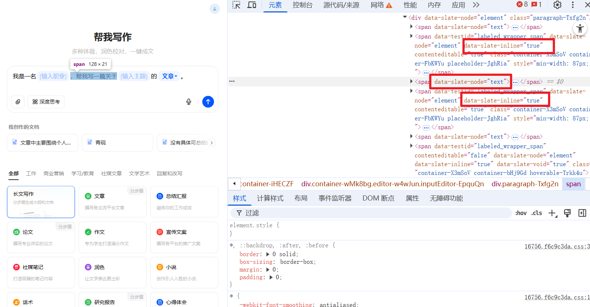

```
<span data-slate-node="text">
	<span data-slate-leaf="true"><span data-slate-string="true">你好，我是XXX</span>
</span>
```

果然，可以看到这边的html结构是有一定规则的，并且在很多节点上，有统一的data-slate-xxx类型的数据，这命名风格，太有辨识度了。

3. 我们将这一串节点消息复制到豆包chat中，问问这是什么组件库。😂

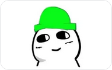

4. 老实人豆包已经回答给我们了

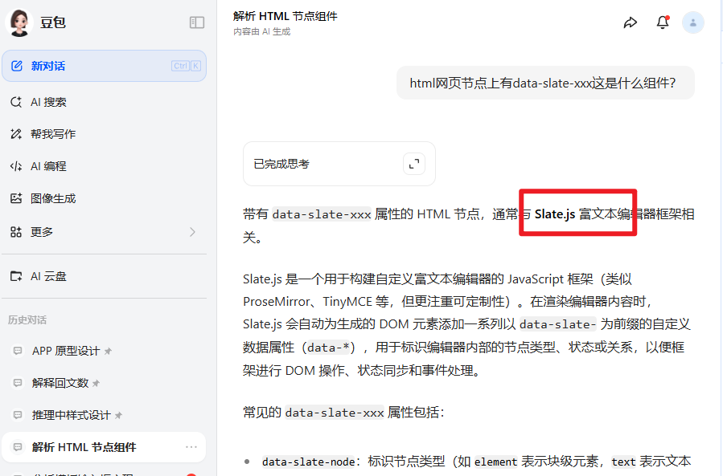

这是 **slate.js** 库，是 React 的 **亲儿子**，完蛋。

5. 问问豆包，看看能不能在vue中使用。

豆包的回答开始牛头不对马嘴，估计是这个库在国内用的人少

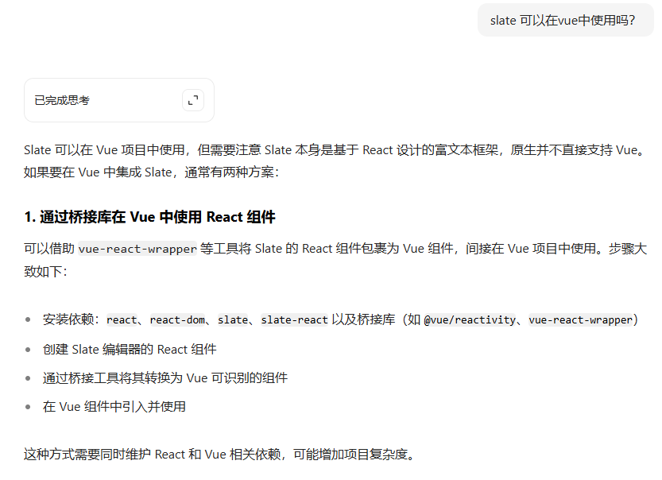

6. 去github上，看看有没有大佬捞一把。搜slate vue

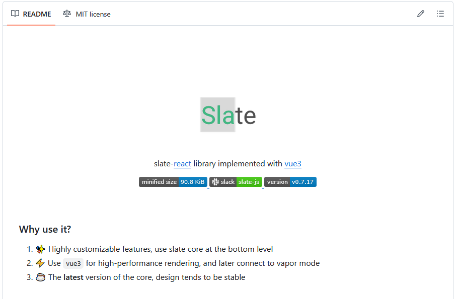

**slate-vue3** 专业对口！感谢大佬又捞了我一把。这就是为 Vue3 量身定制的 Slate 适配层

## 实战：手把手实现模版输入框

### 1. 初始化项目

1. 新建项目

```sh
pnpm create vite@latest doubao-template-input
```
选择 vue3 => 选择 ts

2. 安装依赖和工具

```sh
pnpm i sass

# 注意：如果不想用unocss的同学，不需要安装下面的，将有unocss的代码丢到ai工具里面转一下就行，我这里是为了快速开发。
pnpm i -D unocss @unocss/preset-uno @unocss/eslint-config @unocss/preset-icons @iconify-json/mdi @iconify/vue @iconify-json/ion @iconify/utils
```
依赖版本如下：

```
{
  "name": "doubao-template-input",
  "private": true,
  "version": "0.0.0",
  "type": "module",
  "scripts": {
    "dev": "vite",
    "build": "vue-tsc -b && vite build",
    "preview": "vite preview"
  },
  "dependencies": {
    "@iconify-json/mdi": "^1.2.3",
    "@iconify/vue": "^5.0.0",
    "sass": "^1.92.1",
    "vue": "^3.5.18"
  },
  "devDependencies": {
    "@iconify-json/ion": "^1.2.2",
    "@iconify/utils": "^2.3.0",
    "@types/node": "^24.3.1",
    "@unocss/eslint-config": "^0.65.4",
    "@unocss/preset-icons": "0.65.4",
    "@unocss/preset-uno": "^0.65.4",
    "@vitejs/plugin-vue": "^6.0.1",
    "@vue/tsconfig": "^0.7.0",
    "typescript": "~5.8.3",
    "unocss": "^0.65.4",
    "vite": "^7.1.2",
    "vue-tsc": "^3.0.5"
  }
}

```

3. 配置 unocss

项目根目录新建 uno.config.ts

```
import { resolve } from "node:path";
import { FileSystemIconLoader } from "@iconify/utils/lib/loader/node-loaders";
import { presetIcons } from "@unocss/preset-icons";
import {
  defineConfig,
  presetAttributify,
  presetUno,
  transformerDirectives,
} from "unocss";

export default defineConfig({
  presets: [
    presetUno(),
    presetAttributify(),
    presetIcons({
      // 图标集合配置
      collections: {
        // 使用已安装的图标集
        ion: () =>
          import("@iconify-json/ion/icons.json").then((i) => i.default),
        mdi: () =>
          import("@iconify-json/mdi/icons.json").then((i) => i.default),
        // 自定义图标集合
        custom: FileSystemIconLoader(
          resolve(process.cwd(), "src/assets/svg"),
        ),
      },
      // 图标样式
      extraProperties: {
        display: "inline-block",
        "vertical-align": "middle",
      },
      scale: 1,
      // i-{collection}-{icon}
      prefix: "i-",
    }),
  ],
  transformers: [transformerDirectives()],
  // 定义组合
  shortcuts: {
    // 定义单个样式组合
    // 宽高100%
    "wh-full": "w-full h-full",
    // 一行显示
    "text-truncate":
      "overflow-hidden text-ellipsis whitespace-nowrap break-words",
    // 居中
    "flex-center": "flex items-center justify-center",
  },

  // 定义自定义规则
  rules: [],
});


```

4. src下面的style.css添加样式重置

还需要复制包括豆包的一些css变量，方便快速开发，由于代码过多不一一展示，可以参考我的仓库，也可以去豆包网站的:root节点上复制。

```
/* reset.scss */

/* Reset box sizing */
*,
*::before,
*::after {
  box-sizing: border-box;
}

/* Remove default margin and padding */
html,
body,
div,
h1,
h2,
h3,
h4,
h5,
h6,
p,
ul,
li,
figure,
figcaption {
  margin: 0;
  padding: 0;
}

/* Remove list styles */
ul,
ol {
  list-style: none;
}

/* Set a consistent style for buttons */
button {
  cursor: pointer;
}

/* Set a consistent width for images */
img {
  max-width: 100%;
  height: auto;
}

.clearfix::after {
  content: "";
  display: table;
  clear: both;
}

#app,
body,
html,
main {
  height: 100%;
}


```

5. 修改 APP.VUE 为主界面

因为演示的关系，我们直接在APP.VUE上操作。

APP.VUE

```
<script setup lang="ts">
import ChatInput from './components/ChatInput/index.vue'

</script>

<template>
  <div class="container">
    <div class="content-wrapper">
      <h1>帮我写作</h1>
      <h2>多种体裁，润色校对，一键成文</h2>
      <ChatInput ref="chatInputRef" />
    </div>
  </div>
</template>

<style lang="scss" scoped>
.container {
  width: 100%;
  height: 100%;
  display: flex;
  justify-content: center;
  align-items: center;

  .content-wrapper {
    display: flex;
    flex-direction: column;
    justify-content: center;
    max-width: 809px;
    width: 100%;

    h1 {
      color: var(--s-color-text-secondary);
      font: var(--s-font-h1);
      margin: 28px 0 10px 0;
      text-align: center;
    }

    h2 {
      height: 52px;
      font: var(--s-font-base);
      text-align: center;
      color: rgba(0, 0, 0, 0.3);
      margin-bottom: 20px;
    }

  }
}
</style>
```


6. 基础结构

在 components 中新建 ChatInput/index.vue，完成基础的结构搭建，直接贴代码：

```
<script lang='ts' setup>
</script>

<template>
    <div class='input-container w-full h-128px w-full relative flex flex-col'>
        <!-- 输入框 -->
        <div class="editor-container flex flex-col relative wh-full min-h-0 min-w-0 flex-1 p-[12px_12px_12px_16px]">
            <!-- 输入框主体 -->
            <div class="wh-full flex-1 min-h-0 min-w-0">
            </div>
        </div>
        <!-- 技能 -->
        <div class="skill-box flex items-center justify-between p-[0_12px_12px_12px]">
            <div class="left-box flex flex-center gap-10px">
                <div class="btn-box !p-x-7px">
                    <!-- 旋转-45度 -->
                    <div class="icon i-mdi-attachment rotate-315 text-16px"></div>
                </div>
                <div class="btn-box">
                    <div class="icon i-custom-think"></div>
                    <div class="label">深度思考</div>
                </div>
                <div class="btn-box">
                    <div class="icon i-mdi-web"></div>
                    <div class="label">搜索资料</div>
                </div>
            </div>

            <div class="right-box flex flex-center">
                <div class="icon-btn ">
                    <div class="icon i-custom-microphone size-18px"></div>
                </div>
                <div class="split h-19px w-1px bg-[var(--s-color-border-tertiary)] m-l-4px m-r-12px"></div>
                <div class="icon-btn send-btn">
                    <div class="icon i-custom-arrow-up size-16px color-[var(--s-color-text-inverse-tertiary)]"></div>
                </div>
            </div>
        </div>
    </div>
</template>

<style lang='scss' scoped>
.input-container {
    --chat-input-skill-border-radius: 12px;

    &::after {
        border: 1px solid var(--s-color-border-tertiary);
        border-radius: var(--chat-input-skill-border-radius);
        bottom: 0;
        content: "";
        left: 0;
        pointer-events: none;
        position: absolute;
        right: 0;
        top: 0;
    }

    .editor-container {}


    .skill-box {

        .btn-box {
            border: 1px solid var(--s-color-border-tertiary);
            color: var(--s-color-text-secondary);
            border-radius: 10px;

            display: flex;
            align-items: center;
            justify-content: center;
            gap: 4px;

            height: 36px;
            padding: 0 12px;

            .label {
                color: var(--s-color-text-secondary);
                font: var(--s-font-small-strong);
            }
        }

        .icon-btn {
            width: 32px;
            height: 32px;
            display: flex;
            align-items: center;
            justify-content: center;

        }

        .send-btn {
            border-radius: 18px;
            background-color: var(--s-color-text-disable);
        }
    }
}
</style>
```

效果图预览：

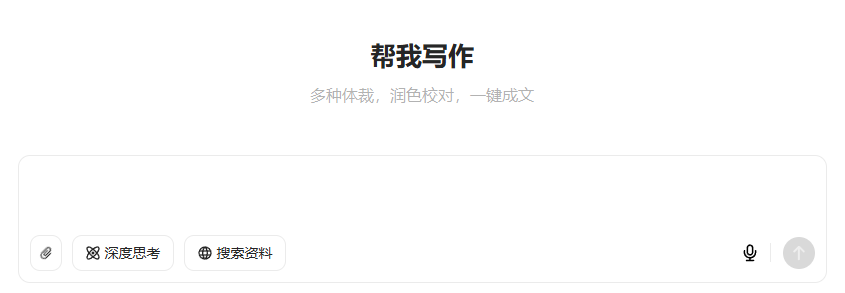

主体结构搭建好了

### 2. 集成 Slate 编辑器

1. 安装依赖

```
pnpm i slate-vue3
```

2. 模版输入框基础布局

直接使用 slate.js 的 Placehold 案例。

```
<script lang='ts' setup>
import { Slate, Editable, type RenderPlaceholderProps } from "slate-vue3"
import { h, ref } from "vue";
import { createEditor } from "slate-vue3/core";
import { withDOM } from "slate-vue3/dom";
import { withHistory } from "slate-vue3/history";


// #region ➤ 初始化编辑器
// ================================================


const initialValue = [
    {
        type: 'paragraph', children: [
            { text: '', },
        ],
    },
]

const renderPlaceholder = ({ children, attributes }: RenderPlaceholderProps) => {
    return h('div', attributes,
        [
            h('p', null, children),
            h('pre', null, 'Use the renderPlaceholder prop to customize rendering of the placeholder')
        ])
}

const editor = withHistory(withDOM(createEditor()));
editor.children = initialValue;

// #endregion 初始化编辑器

</script>

<template>
    <div class='input-container w-full h-128px w-full relative flex flex-col'>
        <!-- 输入框 -->
        <div class="editor-container flex flex-col relative wh-full min-h-0 min-w-0 flex-1 p-[12px_12px_12px_16px]">
            <!-- 输入框主体 -->
            <div class="wh-full flex-1 min-h-0 min-w-0">
                <Slate :editor="editor" :render-placeholder="renderPlaceholder">
                    <Editable style="padding: 10px;" placeholder="Type something" />
                </Slate>
            </div>
        </div>
        <!-- 技能 -->
        <div class="skill-box flex items-center justify-between p-[0_12px_12px_12px]">
            <div class="left-box flex flex-center gap-10px">
                <div class="btn-box !p-x-7px">
                    <!-- 旋转-45度 -->
                    <div class="icon i-mdi-attachment rotate-315 text-16px"></div>
                </div>
                <div class="btn-box">
                    <div class="icon i-custom-think"></div>
                    <div class="label">深度思考</div>
                </div>
                <div class="btn-box">
                    <div class="icon i-mdi-web"></div>
                    <div class="label">搜索资料</div>
                </div>
            </div>

            <div class="right-box flex flex-center">
                <div class="icon-btn ">
                    <div class="icon i-custom-microphone size-18px"></div>
                </div>
                <div class="split h-19px w-1px bg-[var(--s-color-border-tertiary)] m-l-4px m-r-12px"></div>
                <div class="icon-btn send-btn">
                    <div class="icon i-custom-arrow-up size-16px color-[var(--s-color-text-inverse-tertiary)]"></div>
                </div>
            </div>
        </div>
    </div>
</template>

<style lang='scss' scoped>
.input-container {
    --chat-input-skill-border-radius: 12px;

    &::after {
        border: 1px solid var(--s-color-border-tertiary);
        border-radius: var(--chat-input-skill-border-radius);
        bottom: 0;
        content: "";
        left: 0;
        pointer-events: none;
        position: absolute;
        right: 0;
        top: 0;
    }

    .editor-container {

        .slate-container {
            position: relative;
            white-space: pre-wrap;
            overflow-wrap: break-word;
            flex-grow: 1;
            outline: 0;
            overflow-anchor: auto;
            overflow-x: hidden;
            overflow-y: auto;
            height: 100%;
        }


    }


    .skill-box {

        .btn-box {
            border: 1px solid var(--s-color-border-tertiary);
            color: var(--s-color-text-secondary);
            border-radius: 10px;

            display: flex;
            align-items: center;
            justify-content: center;
            gap: 4px;

            height: 36px;
            padding: 0 12px;

            .label {
                color: var(--s-color-text-secondary);
                font: var(--s-font-small-strong);
            }
        }

        .icon-btn {
            width: 32px;
            height: 32px;
            display: flex;
            align-items: center;
            justify-content: center;

        }

        .send-btn {
            border-radius: 18px;
            background-color: var(--s-color-text-disable);
        }
    }
}
</style>
```

3. 效果图预览：

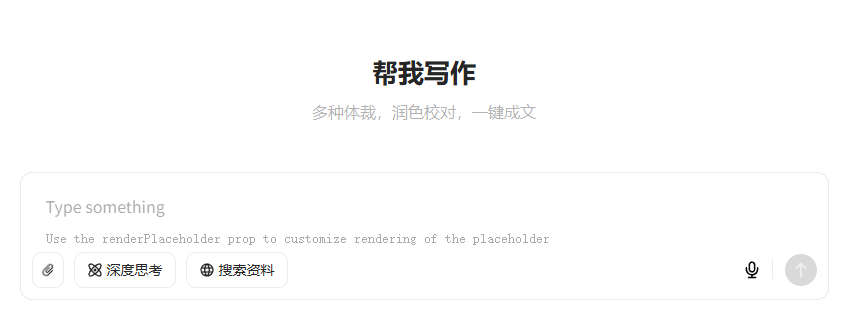

现在可以正常输入文字了，并且在没有输入的时候也会显示placeholder内容


### 3. 实现下拉框组件

1. 类型声明

在 components 目录下 新建type.ts，类型声明如下：

```
import type { BaseEditor, BaseElement } from "slate-vue3/core";
import type { DOMEditor } from "slate-vue3/dom";

export type CustomElement =
  | ParagraphElement
  | InputTagElement
  | SelectTagElement;

// 段落元素
export interface ParagraphElement extends BaseElement {
  type: "paragraph";
  children: (CustomText | CustomElement)[];
}

// 输入标签元素
export interface InputTagElement extends BaseElement {
  type: "input-tag";
  label: string;
  children: CustomText[];
}

// 选择标签元素
export interface SelectTagElement extends BaseElement {
  type: "select-tag";
  value: string;
  options: { label: string; value: string }[];
  children: CustomText[];
}

// 节点联合类型
export type CustomNode = CustomElement | CustomText;

export interface CustomText {
  text: string;
}

export interface selectTagOption {
  label: string;
  value: string;
}

export type CustomEditor = BaseEditor & DOMEditor;

```

其中select-tag 就是下拉框；input-tag 就是输入框

2. 开始编写 **SelectTag** 组件。

先看豆包的效果如下：

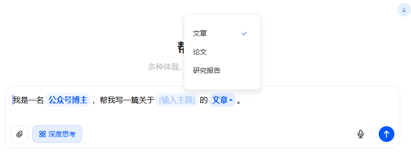

3. 新建SelectTag.vue组件，里面随便放入点东西

```
<script lang='ts' setup>
</script>

<template>
    <div class='base-container'>SelectTag.vue</div>
</template>
```

4. 修改ChatInput/index.vue文件中

在Slate组件上添加render-element，自定义节点的渲染 

```
<Slate ... :render-element="renderElement" ... >
```

在ts中添加的renderElement函数

```
const renderElement = ({ attributes, children, element }: RenderElementProps) => {
    const customElement = element as CustomElement;
    switch (customElement.type) {
        default:
            return h('p', { ...attributes, class: 'slate-common-p' }, children)
    }
}
```

默认渲染p标签，我们添加刚刚新建好的SelectTag.vue组件

```
const renderElement = ({ attributes, children, element }: RenderElementProps) => {
    const customElement = element as CustomElement;
    switch (customElement.type) {
        case 'select-tag':
            return h(SelectTag as unknown as Component, {
                ...useInheritRef(attributes),
                element
            }, () => children);
        default:
            return h('p', { ...attributes, class: 'slate-common-p' }, children)
    }
}
```

5. 为了提前看到效果，在初始中添加 **select-tag** 类型

```
const initialValue = [
    { type: 'paragraph', children: [{ text: '' },{ text: 'select' },{ text: '' }], },
]
```

完整代码如下：

```
<script lang='ts' setup>
import { Slate, Editable, type RenderPlaceholderProps, type RenderElementProps, useInheritRef } from "slate-vue3"
import { h, type Component } from "vue";
import { createEditor } from "slate-vue3/core";
import { withDOM } from "slate-vue3/dom";
import { withHistory } from "slate-vue3/history";
import type { CustomElement } from "../type";
import SelectTag from "./components/SelectTag.vue";


// #region ➤ 初始化编辑器
// ================================================


const initialValue = [
    { type: 'paragraph', children: [{ text: '' },{ text: 'select' },{ text: '' }], },
]

const renderPlaceholder = ({ children, attributes }: RenderPlaceholderProps) => {
    return h('div', attributes,
        [
            h('p', null, children),
        ])
}


const renderElement = ({ attributes, children, element }: RenderElementProps) => {
    const customElement = element as CustomElement;
    switch (customElement.type) {
        case 'select-tag':
            return h(SelectTag as unknown as Component, {
                ...useInheritRef(attributes),
                element
            }, () => children);
        default:
            return h('p', { ...attributes, class: 'slate-common-p' }, children)
    }
}

const editor = withHistory(withDOM(createEditor()))
editor.children = initialValue;

// #endregion 初始化编辑器
</script>

<template>
    <div class='input-container max-w-809px h-128px w-full relative flex flex-col'>
        <!-- 输入框 -->
        <div class="editor-container flex flex-col relative wh-full min-h-0 min-w-0 flex-1 p-[12px_12px_12px_16px]">
            <!-- 输入框主体 -->
            <div class="wh-full flex-1 min-h-0 min-w-0">
                <Slate :editor="editor" :render-element="renderElement" :render-placeholder="renderPlaceholder">
                    <Editable class="slate-container" style="padding: 10px;" placeholder="你好" />
                </Slate>
            </div>
        </div>
        <!-- 技能 -->
        <div class="skill-box flex items-center justify-between p-[0_12px_12px_12px]">
            <div class="left-box flex flex-center gap-10px">
                <div class="btn-box !p-x-7px">
                    <!-- 旋转-45度 -->
                    <div class="icon i-mdi-attachment rotate-315 text-16px"></div>
                </div>
                <div class="btn-box">
                    <div class="icon i-custom-think"></div>
                    <div class="label">深度思考</div>
                </div>
                <div class="btn-box">
                    <div class="icon i-mdi-web"></div>
                    <div class="label">搜索资料</div>
                </div>
            </div>

            <div class="right-box flex flex-center">
                <div class="icon-btn ">
                    <div class="icon i-custom-microphone size-18px"></div>
                </div>
                <div class="split h-19px w-1px bg-[var(--s-color-border-tertiary)] m-l-4px m-r-12px"></div>
                <div class="icon-btn send-btn">
                    <div class="icon i-custom-arrow-up size-16px color-[var(--s-color-text-inverse-tertiary)]"></div>
                </div>
            </div>
        </div>
    </div>
</template>

<style lang='scss' scoped>
.input-container {
    --chat-input-skill-border-radius: 12px;

    &::after {
        border: 1px solid var(--s-color-border-tertiary);
        border-radius: var(--chat-input-skill-border-radius);
        bottom: 0;
        content: "";
        left: 0;
        pointer-events: none;
        position: absolute;
        right: 0;
        top: 0;
    }

    .editor-container {

        .slate-container {
            position: relative;
            white-space: pre-wrap;
            overflow-wrap: break-word;
            flex-grow: 1;
            outline: 0;
            overflow-anchor: auto;
            overflow-x: hidden;
            overflow-y: auto;
            height: 100%;
        }

    }


    .skill-box {

        .btn-box {
            border: 1px solid var(--s-color-border-tertiary);
            color: var(--s-color-text-secondary);
            border-radius: 10px;

            display: flex;
            align-items: center;
            justify-content: center;
            gap: 4px;

            height: 36px;
            padding: 0 12px;

            .label {
                color: var(--s-color-text-secondary);
                font: var(--s-font-small-strong);
            }
        }

        .icon-btn {
            width: 32px;
            height: 32px;
            display: flex;
            align-items: center;
            justify-content: center;

        }

        .send-btn {
            border-radius: 18px;
            background-color: var(--s-color-text-disable);
        }
    }
}
</style>
```

6. 可以看到页面上已经渲染了 

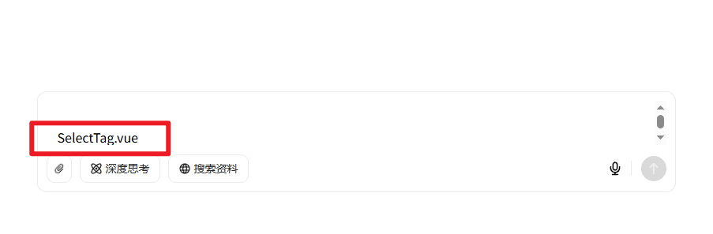

7. 接下来就是修改 SelectTag.vue 组件的样式了，这个省略不说，直接给出代码。

```
<!-- SelectTag.vue -->
<script setup lang="ts">
import { useEditor } from 'slate-vue3'
import { ref, watch } from "vue";
import { type HTMLAttributes, useAttrs } from 'vue';
import { DOMEditor } from "slate-vue3/dom";
import { Element, Transforms } from 'slate-vue3/core'
import { type CustomElement, type selectTagOption } from '../../type';

const editor = useEditor()
const attrs: HTMLAttributes = useAttrs()

interface Props {
    element: {
        options: selectTagOption[];
        value?: string;
    };
}

const props = defineProps<Props>();
const emit = defineEmits(['change']);

// 当前选中的值
const selectedValue = ref(props.element.value || props.element.options[0].value);

// 当元素值变化时更新
watch(() => props.element.value, (newValue) => {
    if (newValue) {
        selectedValue.value = newValue;
    }
});

// 选择变化时触发
const onSelectChange = (event: Event) => {
    const value = (event.target as HTMLSelectElement).value;
    if (!props.element) return false;
    const path = DOMEditor.findPath(editor, props.element as unknown as Element)
    Transforms.setNodes(editor, { value: value } as Partial<CustomElement>, { at: path });
};
</script>

<template>
    <div v-bind="attrs" data-slate-inline="true" class="select-tag" contenteditable="false">
        <select v-model="selectedValue" @change="onSelectChange" class="custom-select">
            <option v-for="option in element.options" :key="option.value" :value="option.value">
                {{ option.label }}
            </option>
        </select>
    </div>
</template>

<style scoped>
.select-tag {

    display: inline-block;
    background: var(--s-color-brand-primary-transparent-1, rgba(0, 102, 255, .06));
    border-radius: 10px;
    padding: 2px 6px;
    margin: 2px 3px;
    line-height: 150%;
    word-break: break-word;
    border: 0 solid;
    box-sizing: border-box;

    padding-left: 11px;
}

.custom-select {
    /* 重置默认样式 */
    appearance: none;
    -webkit-appearance: none;
    -moz-appearance: none;

    /* 基本样式 */
    background: transparent;
    border: none;
    outline: none;
    font-size: 16px;
    color: var(--s-color-brand-primary-default, #06f);
    font-weight: 600;
    cursor: pointer;
    padding: 0 16px 0 0;

    /* 添加自定义下拉箭头 */
    background-image: url("data:image/svg+xml,%3Csvg xmlns='http://www.w3.org/2000/svg' viewBox='0 0 24 24' fill='%235356F0'%3E%3Cpath d='M7 10l5 5 5-5z'/%3E%3C/svg%3E");
    background-repeat: no-repeat;
    background-position: calc(100%) center;
    background-size: 16px;
}

.custom-select:focus {
    outline: none;
}
</style>
```

8. 同时修改初始化变量 initialValue 这样就能直接看到效果

```
const initialValue = [
      {
        type: 'paragraph',
        children: [
            { text: '这是一个示例' },
            { type: 'select-tag', children: [{ text: '' }], value: '选项1', options: [{ label: '选项1', value: '选项1' }, { label: '选项2', value: '选项2' }, { label: '选项3', value: '选项3' }], },
            { text: '' }, // 不要忘记用 text 结尾，不然会出现问题
        ]
      }
    ]
```

9. 预览效果如下：
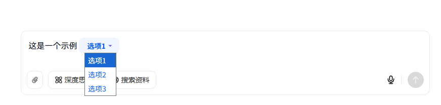

因为时间关系这边就不修改select样式了，有空大家可以自行修改。


### 4. 优化编辑器

现在已经有5分相似了，现在我们优化编辑器，让placeholder支持自定义样式。

1. 修改renderPlaceholder函数

```
const renderPlaceholder = () => {
    return h('div', { class: 'slate-common-placeholder', },
        [
            h('p', null, placeholder.value),
        ])
}
```

2. 添加如下样式，注意不可以使用scope

```
<style lang='scss'>
.slate-common-placeholder {
    position: absolute;
    color: #C9CDD4;
    font-family: "HarmonyOS Sans SC";
    font-size: 16px;
    font-style: normal;
    font-weight: 300;
    line-height: 34px;
    text-transform: capitalize;
    top: 0 !important;
    pointer-events: none;
    user-select: none;
    text-decoration: none;
    width: 100%;
    max-width: 100%;
}

.slate-common-p {
    color: #020814;
    font-family: "HarmonyOS Sans SC";
    font-size: 16px;
    font-style: normal;
    font-weight: 300;
    line-height: 175%;
    text-transform: capitalize;
}
</style>
```

3. 添加 renderLeaf 让编辑器的光标在正确的位置

空文本节点需添加`padding-left: 0.1px`避免光标消失

```
const renderLeaf = ({ attributes, children, leaf }: RenderLeafProps) => h('span', {
    ...attributes, style: {
        paddingLeft: leaf.text === '' ? '0.1px' : ''
    }
}, children)
```

```
<Slate ... :render-leaf="renderLeaf" ... >
```

4. 添加 withInlines ，让编辑器的赋值粘贴可用

```
const withInlines = (editor: CustomEditor) => {
    const { isInline } = editor;

    editor.isInline = element =>
        ['select-tag'].includes((element as CustomElement).type) || isInline(element)

    return editor
}


const editor = withHistory(withInlines(withDOM(createEditor())));
```

5. 目前完整代码如下：

```
<script lang='ts' setup>
import { Slate, Editable, type RenderPlaceholderProps, type RenderElementProps, useInheritRef, type RenderLeafProps } from "slate-vue3"
import { h, ref, type Component } from "vue";
import { createEditor, Editor, type BaseElement } from "slate-vue3/core";
import { withDOM } from "slate-vue3/dom";
import { withHistory } from "slate-vue3/history";
import type { CustomEditor, CustomElement } from "../type";
import SelectTag from "./components/SelectTag.vue";


// #region ➤ 初始化编辑器
// ================================================

const placeholder = ref('输入主题和写作要求')

const initialValue = [
    {
        type: 'paragraph', children: [
            { text: '我是计算机专业的', },
            { type: 'select-tag', children: [{ text: '' }], value: '本科生', options: [{ label: '本科生', value: '本科生' }, { label: '研究生', value: '研究生' }, { label: '博士生', value: '博士生' }] },
            { text: '帮我写一篇关于的论文。', },
        ],
    },
]

const renderPlaceholder = () => {
    return h('div', { class: 'slate-common-placeholder', },
        [
            h('p', null, placeholder.value),
        ])
}

const renderLeaf = ({ attributes, children, leaf }: RenderLeafProps) => h('span', {
    ...attributes, style: {
        paddingLeft: leaf.text === '' ? '0.1px' : ''
    }
}, children)


const withInlines = (editor: CustomEditor) => {
    const { isInline } = editor;

    editor.isInline = element =>
        ['select-tag'].includes((element as CustomElement).type) || isInline(element)

    return editor
}

const renderElement = ({ attributes, children, element }: RenderElementProps) => {
    const customElement = element as CustomElement;
    switch (customElement.type) {
        case 'select-tag':
            return h(SelectTag as unknown as Component, {
                ...useInheritRef(attributes),
                element
            }, () => children);
        default:
            return h('p', { ...attributes, class: 'slate-common-p' }, children)
    }
}

const editor = withHistory(withInlines(withDOM(createEditor())));
editor.children = initialValue;

// #endregion 初始化编辑器
</script>

<template>
    <div class='input-container max-w-809px h-128px w-full relative flex flex-col'>
        <!-- 输入框 -->
        <div class="editor-container flex flex-col relative wh-full min-h-0 min-w-0 flex-1 p-[12px_12px_12px_16px]">
            <!-- 输入框主体 -->
            <div class="wh-full flex-1 min-h-0 min-w-0">
                <Slate :editor="editor" :render-element="renderElement" :render-placeholder="renderPlaceholder"
                    :render-leaf="renderLeaf">
                    <Editable class="slate-container" :placeholder="placeholder" />
                </Slate>
            </div>
        </div>
        <!-- 技能 -->
        <div class="skill-box flex items-center justify-between p-[0_12px_12px_12px]">
            <div class="left-box flex flex-center gap-10px">
                <div class="btn-box !p-x-7px">
                    <!-- 旋转-45度 -->
                    <div class="icon i-mdi-attachment rotate-315 text-16px"></div>
                </div>
                <div class="btn-box">
                    <div class="icon i-custom-think"></div>
                    <div class="label">深度思考</div>
                </div>
                <div class="btn-box">
                    <div class="icon i-mdi-web"></div>
                    <div class="label">搜索资料</div>
                </div>
            </div>

            <div class="right-box flex flex-center">
                <div class="icon-btn ">
                    <div class="icon i-custom-microphone size-18px"></div>
                </div>
                <div class="split h-19px w-1px bg-[var(--s-color-border-tertiary)] m-l-4px m-r-12px"></div>
                <div class="icon-btn send-btn">
                    <div class="icon i-custom-arrow-up size-16px color-[var(--s-color-text-inverse-tertiary)]"></div>
                </div>
            </div>
        </div>
    </div>
</template>

<style lang='scss' scoped>
.input-container {
    --chat-input-skill-border-radius: 12px;

    &::after {
        border: 1px solid var(--s-color-border-tertiary);
        border-radius: var(--chat-input-skill-border-radius);
        bottom: 0;
        content: "";
        left: 0;
        pointer-events: none;
        position: absolute;
        right: 0;
        top: 0;
    }

    .editor-container {

        .slate-container {
            position: relative;
            white-space: pre-wrap;
            overflow-wrap: break-word;
            flex-grow: 1;
            outline: 0;
            overflow-anchor: auto;
            overflow-x: hidden;
            overflow-y: auto;
            height: 100%;
        }


    }


    .skill-box {

        .btn-box {
            border: 1px solid var(--s-color-border-tertiary);
            color: var(--s-color-text-secondary);
            border-radius: 10px;

            display: flex;
            align-items: center;
            justify-content: center;
            gap: 4px;

            height: 36px;
            padding: 0 12px;

            .label {
                color: var(--s-color-text-secondary);
                font: var(--s-font-small-strong);
            }
        }

        .icon-btn {
            width: 32px;
            height: 32px;
            display: flex;
            align-items: center;
            justify-content: center;

        }

        .send-btn {
            border-radius: 18px;
            background-color: var(--s-color-text-disable);
        }
    }
}
</style>


<style lang='scss'>
.slate-common-placeholder {
    position: absolute;
    color: #C9CDD4;
    font-family: "HarmonyOS Sans SC";
    font-size: 16px;
    font-style: normal;
    font-weight: 300;
    line-height: 34px;
    text-transform: capitalize;
    top: 0 !important;
    pointer-events: none;
    user-select: none;
    text-decoration: none;
    width: 100%;
    max-width: 100%;
}

.slate-common-p {
    color: #020814;
    font-family: "HarmonyOS Sans SC";
    font-size: 16px;
    font-style: normal;
    font-weight: 300;
    line-height: 175%;
    text-transform: capitalize;
}
</style>
```

6. 预览效果如下：

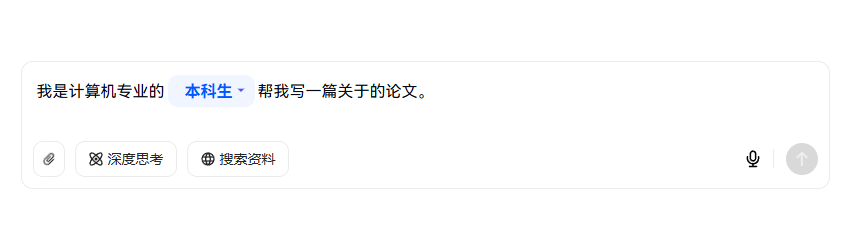

### 5. 实现输入框组件

接下来开始下一个组件 **输入框组件 **

1. 新建InputTag.vue 文件

```
<!-- PlaceholderTag.vue -->
<script setup lang="ts">
import { ref, watchEffect, onMounted, nextTick } from "vue";
import { type HTMLAttributes, useAttrs } from 'vue';
const attrs: HTMLAttributes = useAttrs()

interface Props {
    element: {
        label: string;
        children: Array<{ text: string }>;
    };
}

const props = defineProps<Props>();

// 创建标签文本宽度的引用
const labelWidth = ref('auto');
// 创建用于测量宽度的隐藏标签
const measureLabelRef = ref<HTMLSpanElement | null>(null);
// 创建占位符标签容器引用
const containerRef = ref<HTMLSpanElement | null>(null);
// 测量宽度
const measureWidth = ref<string>("auto");

// 动态计算是否显示标签
const showLabel = ref(true);

// 监听标签文本变化以测量宽度
watchEffect(() => {
    if (measureLabelRef.value && props.element.label) {
        nextTick(() => {
            measureWidth.value = `${measureLabelRef.value!.offsetWidth + 24}px`;
        });
    }
});

// 监听子节点文本内容变化
watchEffect(() => {
    const textContent = props.element.children
        .map(child => child.text)
        .join("")
        .replace(/\uFEFF/g, ""); // 移除零宽空格

    showLabel.value = textContent.trim() === "";

    // 有内容时重置宽度为 auto
    if (!showLabel.value && containerRef.value) {
        labelWidth.value = 'auto';
    } else if (containerRef.value) {
        labelWidth.value = measureWidth.value;
    }
});

// 空文本节点以确保光标位置正确
onMounted(() => {
    if (props.element.children.length === 0) {
        props.element.children.push({ text: "" });
    }
});
</script>

<template>
    <span ref="containerRef" v-bind="attrs" data-slate-inline="true" class="placeholder-tag relative"
        :style="{ minWidth: labelWidth }">
        <!-- 测量元素 -->
        <span ref="measureLabelRef" class="measure-label">{{ element.label }}</span>

        <!-- 标签部分 - 只在没有内容时显示 -->
        <div v-show="showLabel" contenteditable="false" class="start-point">
            <div class="placeholder">{{ element.label }}</div>
        </div>

        <!-- 可编辑区域 -->
        <span class="editable-content">
            <slot />
        </span>
    </span>
</template>

<style lang="scss" scoped>
.placeholder-tag {
    --s-color-brand-primary-transparent-1: rgba(0, 87, 255, .06);
    --s-color-brand-primary-default: #0057ff;

    min-width: auto;

    box-sizing: border-box;
    display: inline-block;
    padding: 2px 6px;
    margin: 2px 3px;
    border-radius: 10px;
    position: relative;
    background: var(--s-color-brand-primary-transparent-1, rgba(0, 102, 255, .06));
    font-weight: 600;
    line-height: 150%;
    word-break: break-word;
    border: 0 solid;
}

.start-point {
    display: inline-block;
    pointer-events: none;
    opacity: 0.7;
    position: absolute;
    top: 0;
    left: 0;
    pointer-events: none;
}

.placeholder {
    pointer-events: none;
    color: #0057ff;
    opacity: .3;
    display: inline-block;
    white-space: nowrap;
    padding: 0 12px;
    font-family: "HarmonyOS Sans SC";
    font-size: 16px;
    font-style: normal;
    font-weight: 500;
    line-height: 24px;
    text-transform: capitalize;

}

.editable-content {
    display: inline-block;
    min-width: 100%;
    position: relative;
    z-index: 1;
    color: var(--s-color-brand-primary-default, #06f);
    font-size: 16px;
    font-weight: 600;
    line-height: 150%;
    text-transform: capitalize;
    padding-left: 0;
}

.measure-label {
    visibility: hidden;
    position: absolute;
    white-space: nowrap;
    font-size: 16px;
}
</style>
```

2. 在编辑器中使用

```
const renderElement = ({ attributes, children, element }: RenderElementProps) => {
    const customElement = element as CustomElement;
    switch (customElement.type) {
        case 'select-tag':
            return h(SelectTag as unknown as Component, {
                ...useInheritRef(attributes),
                element
            }, () => children);
        case 'input-tag':
            return h(InputTag as unknown as Component, {
                ...useInheritRef(attributes),
                element
            }, () => children);
        default:
            return h('p', { ...attributes, class: 'slate-common-p' }, children)
    }
}
// 修改 initialValue
const initialValue = [
    {
        type: 'paragraph', children: [
            { text: '我是计算机专业的', },
            { type: 'select-tag', children: [{ text: '' }], value: '本科生', options: [{ label: '本科生', value: '本科生' }, { label: '研究生', value: '研究生' }, { label: '博士生', value: '博士生' }] },
            { text: '帮我写一篇关于', },
            { type: 'input-tag', children: [{ text: '' }], label: '[输入主题]' },
            { text: '的论文。', },
        ],
    },
]

// 不要忘记修改withInlines
const withInlines = (editor: CustomEditor) => {
    const { isInline } = editor;

    editor.isInline = element =>
        ['select-tag', 'input-tag'].includes((element as CustomElement).type) || isInline(element)

    return editor
}
```

3. 至此输入框组件完成，预览效果如下：

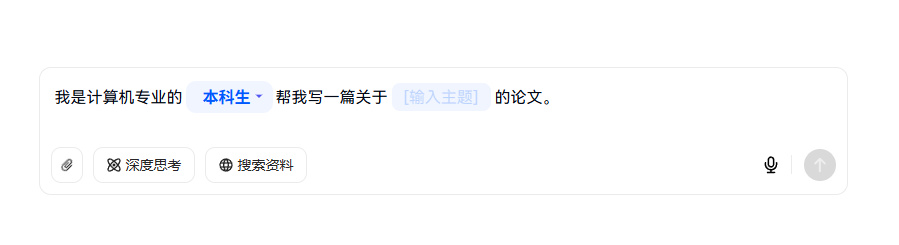

4. 接下来将“计算机”改为输入框组件

5. 最终的呈现效果如下：

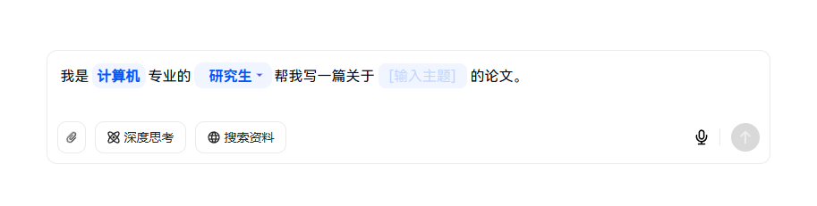

已经完全一模一样了。


### 6. 拿到用户输入内容

现在实现拿到用户输入内容的逻辑，

具体逻辑是：点击发送按钮的时候，我们要从编辑器中拿到所有组件的值：

1. 发送按钮添加点击事件

```
<div class="icon-btn send-btn" @click="send">
```

2. 获取发送内容

```
// #region ➤ 获取发送内容
// ================================================

// 自定义序列化函数，处理所有元素类型
const serializeToPlainText = (nodes: any[]): string => {
    return nodes.map(node => {
        // 处理文本节点
        if (Text.isText(node)) {
            return node.text;
        }

        // 处理自定义元素
        const children = serializeToPlainText(node.children);

        switch (node.type) {
            case 'input-tag':
                return children || node.label || '';
            case 'select-tag':
                return node.value || '';
            case 'paragraph':
                return children + '\n\n';
            default:
                return children;
        }
    }).join('');
};

function send() {
    const content = serializeToPlainText(editor.children);
    console.info('输出内容', content);
    alert(content);
}

// #endregion 获取发送内容
```

3. 预览效果如下：

点击发送按钮

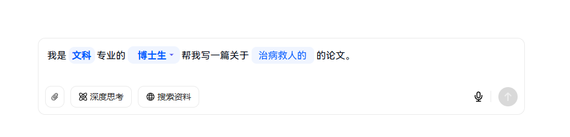

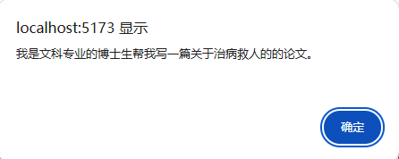

输出成功


### 7. 实现外层选择技能

接下来完成在外层选择技能的功能。

1. 编辑器向外暴露方法，该方法能修改编辑器的内容。代码如下：

```
// #region ➤ 使用技能
// ================================================

function setEditValue(value: Node | Node[]) {
    // 应用新内容
    Editor.withoutNormalizing(editor, () => {
        // 清空现有内容
        for (let i = editor.children.length - 1; i >= 0; i--) {
            Transforms.removeNodes(editor, { at: [i] });
        }

        // 插入新内容
        Transforms.insertNodes(editor, value);
    });

    // 重置选择位置到开头
    const startPoint = Editor.start(editor, [0, 0]);
    Transforms.select(editor, {
        anchor: startPoint,
        focus: startPoint
    });
}

// #endregion 使用技能

defineExpose({
    setEditValue
})
```

2. 恢复 initialValue 变量

```
const initialValue = [
    {
        type: 'paragraph', children: [
            { text: '', },
        ],
    },
]
```

3. 修改外层的APP.VUE，支持调用编辑器的方法。

```
<script setup lang="ts">
import { ref } from 'vue';
import ChatInput from './components/ChatInput/index.vue'
import type { Node } from 'slate-vue3/core';
import type { CustomNode } from './components/type';

const skills = ref<{
  label: string;
  value: string;
  url: string;
  description: string;
  skill: CustomNode[];
}[]>([
  {
    label: '写作',
    value: '1',
    url: "",
    description: "分步骤生成大纲和文档",
    skill: [
      {
        type: 'paragraph',
        children: [
          { text: '我是一名' },
          { type: 'input-tag', children: [{ text: '公众号博主' }], label: '[输入职业]' },
          { text: '，帮我写一篇关于' },
          { type: 'input-tag', children: [{ text: '' }], label: '[输入主题]' },
          { type: 'select-tag', children: [{ text: '' }], value: '文章', options: [{ label: '文章', value: '文章' }, { label: '论文', value: '论文' }, { label: '研究报告', value: '研究报告' }] },
        ]
      }
    ]
  },
  {
    label: '翻译',
    value: '2',
    url: "https://lf-flow-web-cdn.doubao.com/obj/flow-doubao/samantha/writing-templates/icon/Article.png",
    description: "撰写各主流平台文章",
    skill: [
      {
        type: 'paragraph', children: [
          { text: '我是', },
          { type: 'input-tag', children: [{ text: '计算机' }], label: '[计算机]' },
          { text: '专业的', },
          { type: 'select-tag', children: [{ text: '' }], value: '本科生', options: [{ label: '本科生', value: '本科生' }, { label: '研究生', value: '研究生' }, { label: '博士生', value: '博士生' }] },
          { text: '帮我写一篇关于', },
          { type: 'input-tag', children: [{ text: '' }], label: '[输入主题]' },
          { text: '的论文。', },
        ],
      },
    ]
  },
  {
    label: '翻译',
    value: '3',
    url: "https://lf-flow-web-cdn.doubao.com/obj/flow-doubao/samantha/writing-templates/icon/Article.png",
    description: "凝练你的工作成效",
    skill: [
      {
        type: 'paragraph',
        children: [{ text: '这是一个段落' }]
      }
    ]
  },
  {
    label: '翻译',
    value: '4',
    url: "https://lf-flow-web-cdn.doubao.com/obj/flow-doubao/samantha/writing-templates/icon/Article.png",
    description: "撰写专业详实的论文",
    skill: [
      {
        type: 'paragraph',
        children: [{ text: '这是一个段落' }]
      }
    ]
  },
  {
    label: '翻译',
    value: '5',
    url: "https://lf-flow-web-cdn.doubao.com/obj/flow-doubao/samantha/writing-templates/icon/Article.png",
    description: "专为学生打造满分作文",
    skill: [
      {
        type: 'paragraph',
        children: [{ text: '这是一个段落' }]
      }
    ]
  },
])

const chatInputRef = ref<InstanceType<typeof ChatInput> | null>(null);

function handleSelect(item: { skill: Node[] }) {
  chatInputRef.value?.setEditValue(item.skill)
}
</script>

<template>
  <div class="container">
    <div class="content-wrapper">
      <h1>帮我写作</h1>
      <h2>多种体裁，润色校对，一键成文</h2>
      <ChatInput ref="chatInputRef" />
      <!-- 技能列表 -->
      <div class="skill-box">
        <div class="skill-item" v-for="item in skills" :key="item.value" @click="handleSelect(item)">
          <div class="item-header">
            
            <div class="skill-label">{{ item.label }}</div>
          </div>
          <div class="item-description">
            {{ item.description }}
          </div>
        </div>
      </div>
    </div>
  </div>
</template>

<style lang="scss" scoped>
.container {
  width: 100%;
  height: 100%;
  display: flex;
  justify-content: center;
  align-items: center;

  .content-wrapper {
    display: flex;
    flex-direction: column;
    justify-content: center;
    max-width: 809px;
    width: 100%;

    h1 {
      color: var(--s-color-text-secondary);
      font: var(--s-font-h1);
      margin: 28px 0 10px 0;
      text-align: center;
    }

    h2 {
      height: 52px;
      font: var(--s-font-base);
      text-align: center;
      color: rgba(0, 0, 0, 0.3);
      margin-bottom: 20px;
    }

    .skill-box {
      display: grid;
      grid-template-columns: repeat(4, 1fr);
      gap: 10px;
      margin-bottom: 20px;
      margin-top: 20px;

      .skill-item {
        border: 1px solid rgba(0, 0, 0, 0.08);
        border-radius: 10px;
        height: 86px;
        display: flex;
        flex-direction: column;
        padding: 10px 16px 0 16px;
        cursor: pointer;
        transition: all 0.2s ease;

        &:hover {
          box-shadow: 0 4px 12px rgba(0, 0, 0, 0.1);
          transform: translateY(-2px);
        }

        .item-header {
          display: flex;
          align-items: center;

          .skill-icon {
            width: 18px;
            height: 18px;
          }

          .skill-label {
            color: var(--s-color-text-primary);
            font: var(--s-font-small-strong);
            padding-left: 8px;
          }
        }

        .item-description {
          height: 32px;
          margin-top: 4px;
          width: 100%;
          color: var(--s-color-text-quaternary);
          font-size: 12px;
          line-height: 16px;
        }
      }
    }
  }
}
</style>
```

4. 预览效果如下：

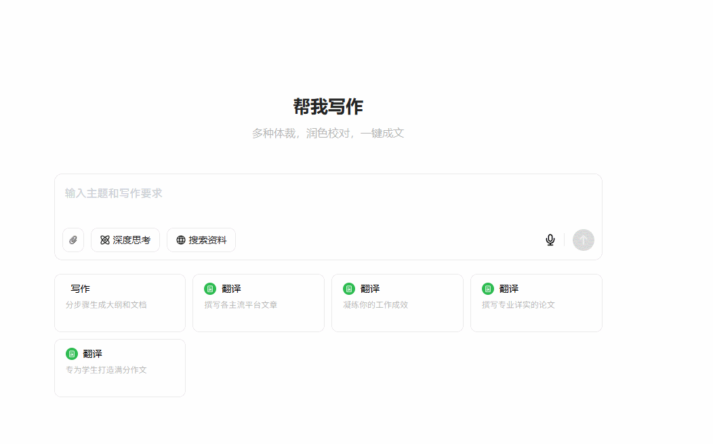


## 总结

现在已经完成实现了豆包的模版输入框功能；得益于 **slate-vue3** 库的使用，拥有良好的健壮性和可维护性。

注意要点：

1. 空文本节点的光标处理是个高频坑点（padding-left: 0.1px是救星）
2. 自定义内联元素必须显式声明 isInline，否则复制粘贴会出问题
3. Slate 操作必须使用 Transforms API，直接修改节点会破坏内部状态


## github 代码仓库：

> 项目完整代码已上传 GitHub，包含详细注释和优化：https://github.com/fffmoon/doubao-template-input