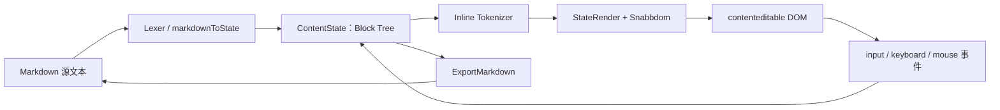

这里的 Muya，实际上是 Coolma 抽出来的 `coolma-muya` Markdown 编辑器核心。它的核心思想可以概括成一句话：

> Markdown 是唯一真源，编辑器把它转换成可编辑的结构树，再渲染成富文本 DOM；用户操作后再从结构树导回 Markdown。

整体数据流大致是：



### 1. 核心模型：Block Tree

Muya 不直接把 HTML 当作编辑模型，而是在 `ContentState` 中维护一棵块级树：

- `p`、`h1`、`blockquote`、`ul`、`table` 等是容器或段落块；
- `span` 是真正承载文本的叶子块；
- 每个 block 有稳定的 `key`；
- 同时维护 `parent`、`preSibling`、`nextSibling` 和 `children`。

相关代码在：

- [`contentState/index.js`](E:/work-coolma/coolma/_plugins/coolma-muya/lib/contentState/index.js)
- [`utils/importMarkdown.js`](E:/work-coolma/coolma/_plugins/coolma-muya/lib/utils/importMarkdown.js)

这样设计的好处是，回车、删除、列表缩进、表格单元格操作等，都可以直接操作结构树，而不是依赖浏览器不稳定的 `contenteditable` HTML。

例如：

```text
Markdown
└── ul
    └── li
        ├── input[type=checkbox]
        └── span("item text")
```

### 2. Markdown 解析分两层

Muya 的解析器大致分为两层：

#### 块级解析

通过类似 Marked 的 Lexer，把 Markdown 解析成 heading、paragraph、list、table、code、blockquote 等块。

入口主要在：

[`parser/index.js`](E:/work-coolma/coolma/_plugins/coolma-muya/lib/parser/index.js)

#### 行内解析

对于文本型 block，再运行 tokenizer，将文本切成：

- `strong`
- `em`
- `del`
- `inline_code`
- `link`
- `image`
- `inline_math`
- `emoji`
- `html_tag`
- `echo_anno`

每个 token 都带有 `range`，因此编辑器可以把光标、搜索高亮和格式化范围映射回原始文本。

这也是它能实现“看起来像富文本，但本质仍然是 Markdown”的关键。

### 3. 渲染：Block → Token → VNode → DOM

渲染入口是 `StateRender`：

[`parser/render/index.js`](E:/work-coolma/coolma/_plugins/coolma-muya/lib/parser/render/index.js)

它会根据 block 是否有子节点，选择：

- `renderContainerBlock`
- `renderLeafBlock`

叶子块会先 tokenizer，然后根据 token 类型调用对应 renderer。例如：

- 数学公式 → KaTeX
- 代码 → Prism
- Mermaid / Flowchart / Vega → 延迟渲染
- 普通 Markdown → Snabbdom VNode

Muya 使用 Snabbdom 做 DOM patch：

[`parser/render/snabbdom.js`](E:/work-coolma/coolma/_plugins/coolma-muya/lib/parser/render/snabbdom.js)

它不是每次都重建整棵 DOM，而是提供：

- 全量 render
- partialRender
- singleRender

编辑普通段落时通常只更新局部 block，这对编辑性能很重要。

### 4. 编辑事件不是直接改 HTML

键盘、输入、粘贴、拖拽等事件由独立控制器处理：

- `keyboard.js`
- `clipboard.js`
- `dragDrop.js`
- `mouseEvent.js`
- `resize.js`

输入事件的核心逻辑在：

[`contentState/inputCtrl.js`](E:/work-coolma/coolma/_plugins/coolma-muya/lib/contentState/inputCtrl.js)

流程是：

1. 从浏览器 Selection 读取光标位置；
2. 从当前段落 DOM 读取文本；
3. 对比旧 block 内容；
4. 更新 block tree；
5. 处理自动补全括号、Markdown 标记、IME 输入；
6. 写入 History；
7. 重新渲染局部 DOM；
8. 通过 `change` 事件向外通知。

所以 DOM 只是输入和显示层，不是最终数据模型。

### 5. 光标和撤销系统

每个 block 的稳定 `key` 是光标系统的基础。光标保存为：

```js
{
  start: { key, offset },
  end: { key, offset }
}
```

这样即使 DOM 被重新 patch，也能把光标恢复到对应 block。

撤销/重做由：

[`contentState/history.js`](E:/work-coolma/coolma/_plugins/coolma-muya/lib/contentState/history.js)

负责。它保存的是：

- block tree
- cursor
- renderRange

而不是 DOM 快照。这比保存 HTML 更容易保证结构一致性。

### 6. 插件化 UI

Muya 本身不是一个巨大的单体工具栏，而是通过插件注册：

```js
Muya.use(TablePicker)
Muya.use(QuickInsert)
Muya.use(CodePicker)
Muya.use(EmojiPicker)
Muya.use(ImageSelector)
Muya.use(FormatPicker)
```

构造 Muya 实例时，这些插件会被实例化并挂到实例上。

插件主要负责：

- 浮层工具
- 快捷插入
- 表格操作
- 图片工具
- 格式工具
- 链接工具

事件通信通过 `EventCenter` 完成，而不是让各模块互相直接调用：

[`eventHandler/event.js`](E:/work-coolma/coolma/_plugins/coolma-muya/lib/eventHandler/event.js)

这让编辑器内核和 UI 工具之间保持相对松耦合。

### 7. Coolma 的 Rune / Echo 扩展

Coolma 在 Muya 之上增加了两种自定义语法。

#### Rune：块级可交互组件

Rune 在 Markdown 中先保存为占位符，类似：

```html
<div
  data-rune-name="..."
  data-rune-id="..."
  data-rune-node-id="..."
  data-rune-value="..."
>
  ...
</div>
```

渲染阶段再把占位符替换成 Vue 组件。

SFC 编译逻辑在：

[`runeSfcRendererFactory.js`](E:/work-coolma/coolma/src/components/muya/runeSfcRendererFactory.js)

它的设计特点：

- 通过 `vue-template-compiler` 同步解析 SFC；
- 编译结果按 `rune.id + template` 缓存；
- 每个 Rune 使用独立的 `data-v-rune-*` scope；
- SFC 通过 `input` 事件把值写回 Markdown 占位符。

#### Echo：行内注解语法

Echo 采用类似：

```markdown
@EchoName{value: '...'}()
```

解析器把它识别为 `echo_anno` token，然后渲染成行内占位符。

Echo 的运行时开关通过修改共享的 `inlineRules.echo_anno` 实现：

```js
setEchoAnnoRule({ requireParens: true })
```

这意味着不需要重建 Muya，只需更新规则并触发重新渲染。

### 8. Vue 外层只是宿主集成层

Coolma 的 [`Muya.vue`](E:/work-coolma/coolma/src/components/muya/Muya.vue) 主要负责：

- 创建 `new Muya(...)`；
- 注入 Rune、Echo registry；
- 提供图片选择和上传回调；
- 监听 Muya 的 `change`、`selectionChange`；
- 将内容同步到 Vuex / 当前笔记；
- 处理主题、笔记切换和设置变化；
- 管理动态 Vue renderer 的挂载和销毁。

也就是说：

```text
Muya：编辑器内核
Muya.vue：Coolma 业务适配层
Vuex / Echo / Rune：应用能力层
```

这种分层让 Muya 可以独立打包成 npm 包或 UMD bundle，而 Coolma 只负责注入自己的业务扩展。

### 9. 这个设计的主要取舍

优点：

- Markdown 数据结构清晰、可持久化；
- 复杂结构编辑比直接操作 HTML 更可靠；
- block key 让光标和局部渲染更稳定；
- Snabbdom 支持增量更新；
- UI 插件和业务扩展比较容易接入；
- Rune / Echo 可以扩展 Markdown 的表达能力。

代价：

- Block tree、token range、DOM selection 三者之间需要持续同步；
- 自定义语法要同时考虑解析、渲染、编辑、导出；
- DOM 被 patch 后，光标恢复逻辑比较复杂；
- 动态 Rune SFC 本质上是运行时编译，必须严格控制来源和缓存；
- Muya 的 parser 规则是共享引用，运行时修改后需要主动触发重渲染。

如果从源码阅读顺序入手，我建议按这个顺序看：

1. [`lib/index.js`](E:/work-coolma/coolma/_plugins/coolma-muya/lib/index.js)
2. [`lib/contentState/index.js`](E:/work-coolma/coolma/_plugins/coolma-muya/lib/contentState/index.js)
3. [`lib/utils/importMarkdown.js`](E:/work-coolma/coolma/_plugins/coolma-muya/lib/utils/importMarkdown.js)
4. [`lib/parser/index.js`](E:/work-coolma/coolma/_plugins/coolma-muya/lib/parser/index.js)
5. [`lib/parser/render/index.js`](E:/work-coolma/coolma/_plugins/coolma-muya/lib/parser/render/index.js)
6. [`src/components/muya/Muya.vue`](E:/work-coolma/coolma/src/components/muya/Muya.vue)

一句话总结：Muya 是一个“以 Markdown 为源、以 Block Tree 为编辑模型、以 Tokenizer 为格式层、以 Snabbdom 为渲染层、以事件中心和插件为扩展机制”的所见即所得 Markdown 编辑器。
